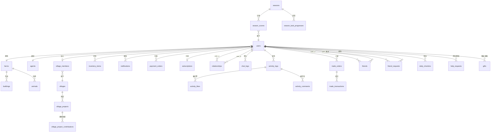

# 农趣村 — 数据库 Schema 设计

> **文档版本**: v1.0
> **最后更新**: 2026-02-28
> **ORM**: Ent (Meta)
> **数据库**: PostgreSQL 15+

---

## 设计原则

1. **PostgreSQL 原生类型** — UUID 主键、JSONB 存储灵活结构（农场格子、配置项）
2. **Ent Schema as Code** — 所有表定义在 `server/ent/schema/` 中，Migration 由 Atlas 管理
3. **JSONB 策略** — 用于频繁整体读写的嵌套数据（Farm.plots、VillageProject.requirements），避免过度范式化
4. **冗余计数器** — ActivityLog.like_count 等使用冗余字段加速列表查询，写时更新
5. **关系表规范** — 双向关系（Friend、Relationship）强制 user_a_id < user_b_id，避免重复行

---

## 表清单（共 28 张）

| # | 表名 | 说明 |
|---|------|------|
| 1 | `users` | 玩家账号 |
| 2 | `farms` | 玩家农场 |
| 3 | `buildings` | 农场建筑 |
| 4 | `animals` | 农场动物 |
| 5 | `inventory_items` | 仓库物品 |
| 6 | `agents` | AI Agent 信息与人格 |
| 7 | `villages` | 村庄 |
| 8 | `village_members` | 村庄成员 |
| 9 | `village_projects` | 共建任务 |
| 10 | `village_project_contributions` | 共建捐献记录 |
| 11 | `relationships` | Agent 间好感度 |
| 12 | `chat_logs` | 对话记录 |
| 13 | `activity_logs` | 动态流 |
| 14 | `activity_likes` | 动态点赞 |
| 15 | `activity_comments` | 动态评论 |
| 16 | `trade_orders` | 交易订单（上架） |
| 17 | `trade_transactions` | 交易成交记录 |
| 18 | `friends` | 好友关系 |
| 19 | `friend_requests` | 好友申请 |
| 20 | `notifications` | 通知 |
| 21 | `daily_checkins` | 每日签到 |
| 22 | `help_requests` | 求助记录 |
| 23 | `gifts` | 赠礼记录 |
| 24 | `seasons` | 赛季配置 |
| 25 | `season_scores` | 赛季积分 |
| 26 | `season_task_progresses` | 赛季任务进度 |
| 27 | `payment_orders` | 充值订单 |
| 28 | `subscriptions` | 月卡订阅 |

---

## ER 图（核心关系）



---

## 表详细说明

### users

| 列名 | 类型 | 约束 | 说明 |
|------|------|------|------|
| id | uuid | PK | |
| openid | varchar | UNIQUE, NULLABLE | 微信 openid |
| phone | varchar(20) | UNIQUE, NULLABLE | 手机号（H5登录） |
| nickname | varchar(32) | NOT NULL | |
| avatar | text | NOT NULL | 头像 URL |
| level | int | NOT NULL, DEFAULT 1 | 农场等级 |
| exp | bigint | NOT NULL, DEFAULT 0 | 经验值 |
| coins | bigint | NOT NULL, DEFAULT 500 | 金币 |
| diamonds | int | NOT NULL, DEFAULT 0 | 钻石 |
| stamina | int | NOT NULL, DEFAULT 100 | 当前体力 |
| max_stamina | int | NOT NULL, DEFAULT 100 | 最大体力 |
| stamina_updated_at | timestamptz | NOT NULL | 体力最后变动时间（用于恢复计算）|
| friendship_points | int | NOT NULL, DEFAULT 0 | 友谊点 |
| is_first_charge | bool | NOT NULL, DEFAULT false | 是否已首充 |
| subscription_expires_at | timestamptz | NULLABLE | 月卡到期时间 |
| created_at | timestamptz | NOT NULL | |
| updated_at | timestamptz | NOT NULL | |

索引：`idx_users_openid(openid)`、`idx_users_phone(phone)`

---

### farms

| 列名 | 类型 | 约束 | 说明 |
|------|------|------|------|
| id | uuid | PK | |
| owner_id | uuid | FK→users, UNIQUE | 农场主 |
| name | varchar(64) | NOT NULL | |
| level | int | NOT NULL, DEFAULT 1 | |
| specialty | jsonb | NOT NULL, DEFAULT '[]' | 村庄特产作物 ID 列表 |
| plots | jsonb | NOT NULL, DEFAULT '[]' | 8×8 地块状态数组（见 PlotState）|
| last_tick_at | timestamptz | NOT NULL | 最后一次 Tick 时间 |
| created_at | timestamptz | NOT NULL | |

**PlotState JSONB 结构**

```json
{
  "x": 0,
  "y": 0,
  "type": "planted",
  "cropId": "tomato",
  "plantedAt": "2026-02-28T08:00:00Z",
  "stage": "mature",
  "quality": "good",
  "wateredAt": "2026-02-28T09:00:00Z",
  "fertilized": false
}
```

---

### buildings

| 列名 | 类型 | 约束 | 说明 |
|------|------|------|------|
| id | uuid | PK | |
| farm_id | uuid | FK→farms | |
| type | varchar(32) | NOT NULL | farmland/warehouse/coop/barn/pen/workshop/well/fence/mailbox |
| level | int | NOT NULL, DEFAULT 1 | 1-3 |
| position_x | int | NOT NULL | 农场坐标 x |
| position_y | int | NOT NULL | 农场坐标 y |
| state | varchar(16) | NOT NULL, DEFAULT 'normal' | normal/building/upgrading |
| finish_at | timestamptz | NULLABLE | 建造/升级完成时间 |
| created_at | timestamptz | NOT NULL | |
| updated_at | timestamptz | NOT NULL | |

索引：`idx_buildings_farm_id(farm_id)`

---

### animals

| 列名 | 类型 | 约束 | 说明 |
|------|------|------|------|
| id | uuid | PK | |
| farm_id | uuid | FK→farms | |
| type | varchar(16) | NOT NULL | chicken/cow/sheep/bee/rabbit |
| name | varchar(32) | NULLABLE | 玩家自定义名字 |
| mood | int | NOT NULL, DEFAULT 50 | 心情值 0-100 |
| health | int | NOT NULL, DEFAULT 100 | 健康值 0-100 |
| last_fed_at | timestamptz | NULLABLE | |
| last_cleaned_at | timestamptz | NULLABLE | |
| last_product_at | timestamptz | NULLABLE | 最后产出时间 |
| created_at | timestamptz | NOT NULL | |
| updated_at | timestamptz | NOT NULL | |

索引：`idx_animals_farm_id(farm_id)`

---

### inventory_items

| 列名 | 类型 | 约束 | 说明 |
|------|------|------|------|
| id | uuid | PK | |
| user_id | uuid | FK→users | |
| item_id | varchar(64) | NOT NULL | "tomato"/"wheat_seed" 等 |
| item_type | varchar(32) | NOT NULL | crop/seed/animal_product/material/recipe/tool/special/decoration |
| quantity | bigint | NOT NULL, DEFAULT 0 | |
| updated_at | timestamptz | NOT NULL | |

唯一索引：`uidx_inventory_user_item(user_id, item_id)`
索引：`idx_inventory_user_type(user_id, item_type)`

---

### agents

| 列名 | 类型 | 约束 | 说明 |
|------|------|------|------|
| id | uuid | PK | |
| user_id | uuid | FK→users, UNIQUE | |
| name | varchar(32) | NOT NULL | Agent 名字 |
| avatar | varchar(64) | NOT NULL | sprite 帧名 |
| extroversion | int | NOT NULL, DEFAULT 5 | 外向度 1-10 |
| generosity | int | NOT NULL, DEFAULT 5 | 慷慨度 1-10 |
| adventure | int | NOT NULL, DEFAULT 5 | 冒险度 1-10 |
| strategy_management | int | NOT NULL, DEFAULT 3 | 经营风格 1-5 |
| strategy_planting | int | NOT NULL, DEFAULT 3 | 种植偏好 1-5 |
| strategy_social | int | NOT NULL, DEFAULT 3 | 社交倾向 1-5 |
| strategy_trade | int | NOT NULL, DEFAULT 3 | 交易策略 1-5 |
| strategy_resource | int | NOT NULL, DEFAULT 3 | 资源分配 1-5 |
| daily_social_count | int | NOT NULL, DEFAULT 0 | 当日社交次数 |
| daily_social_date | timestamptz | NULLABLE | 当日社交次数重置日期 |
| last_active_at | timestamptz | NOT NULL | |
| created_at | timestamptz | NOT NULL | |
| updated_at | timestamptz | NOT NULL | |

---

### villages

| 列名 | 类型 | 约束 | 说明 |
|------|------|------|------|
| id | uuid | PK | |
| name | varchar(64) | NOT NULL | |
| level | int | NOT NULL, DEFAULT 1 | 1-5 |
| contribution | bigint | NOT NULL, DEFAULT 0 | 总贡献值 |
| member_count | int | NOT NULL, DEFAULT 0 | 冗余成员数（加速查询）|
| max_members | int | NOT NULL, DEFAULT 20 | |
| specialty | jsonb | NOT NULL, DEFAULT '[]' | 特产作物 ID 列表 |
| created_at | timestamptz | NOT NULL | |
| updated_at | timestamptz | NOT NULL | |

---

### village_members

| 列名 | 类型 | 约束 | 说明 |
|------|------|------|------|
| id | uuid | PK | |
| village_id | uuid | FK→villages | |
| user_id | uuid | FK→users, UNIQUE | 一个用户只能加入一个村庄 |
| role | varchar(16) | NOT NULL, DEFAULT 'member' | member/elder/chief |
| contribution | bigint | NOT NULL, DEFAULT 0 | 个人对本村总贡献 |
| joined_at | timestamptz | NOT NULL | |

索引：`idx_vm_village_id(village_id)`

---

### village_projects

| 列名 | 类型 | 约束 | 说明 |
|------|------|------|------|
| id | uuid | PK | |
| village_id | uuid | FK→villages | |
| type | varchar(32) | NOT NULL | market/clocktower/road 等 |
| name | varchar(64) | NOT NULL | |
| requirements | jsonb | NOT NULL | 所需资源配置（含当前进度）|
| status | varchar(16) | NOT NULL, DEFAULT 'active' | active/completed/cancelled |
| started_at | timestamptz | NOT NULL | |
| completed_at | timestamptz | NULLABLE | |

**requirements JSONB 结构**

```json
[
  { "type": "material", "itemId": "wood",  "required": 500, "current": 320 },
  { "type": "material", "itemId": "stone", "required": 300, "current": 180 },
  { "type": "coins",                       "required": 10000, "current": 6300 }
]
```

索引：`idx_vp_village_status(village_id, status)`

---

### village_project_contributions

| 列名 | 类型 | 约束 | 说明 |
|------|------|------|------|
| id | uuid | PK | |
| project_id | uuid | FK→village_projects | |
| user_id | uuid | FK→users | |
| resource_type | varchar(16) | NOT NULL | material/coins |
| item_id | varchar(64) | NULLABLE | |
| quantity | bigint | NOT NULL | |
| created_at | timestamptz | NOT NULL | |

索引：`idx_vpc_project_user(project_id, user_id)`

---

### relationships

| 列名 | 类型 | 约束 | 说明 |
|------|------|------|------|
| id | uuid | PK | |
| user_a_id | uuid | FK→users | 永远是 ID 较小的一方（避免重复）|
| user_b_id | uuid | FK→users | |
| affinity | int | NOT NULL, DEFAULT 0 | 好感度 0-100 |
| level | varchar(20) | NOT NULL, DEFAULT 'stranger' | stranger/acquaintance/friend/close_friend/best_friend |
| last_interact_at | timestamptz | NOT NULL | |
| created_at | timestamptz | NOT NULL | |
| updated_at | timestamptz | NOT NULL | |

唯一索引：`uidx_rel_a_b(user_a_id, user_b_id)`
索引：`idx_rel_user_a(user_a_id)`、`idx_rel_user_b(user_b_id)`

---

### chat_logs

| 列名 | 类型 | 约束 | 说明 |
|------|------|------|------|
| id | uuid | PK | |
| user_a_id | uuid | FK→users | 会话双方（小ID）|
| user_b_id | uuid | FK→users | 会话双方（大ID）|
| speaker_user_id | uuid | FK→users | 本条发言方 |
| scene | varchar(32) | NOT NULL | visit/trade/help/gift 等 |
| content | text | NOT NULL | 对话内容 |
| is_llm_generated | bool | NOT NULL, DEFAULT false | |
| created_at | timestamptz | NOT NULL | |

索引：`idx_chat_pair_time(user_a_id, user_b_id, created_at DESC)`

---

### activity_logs

| 列名 | 类型 | 约束 | 说明 |
|------|------|------|------|
| id | uuid | PK | |
| user_id | uuid | FK→users | 动态发布者 |
| village_id | uuid | FK→villages | 所属村庄（用于村庄动态流）|
| type | varchar(32) | NOT NULL | social_visit/harvest_milestone/level_up 等 |
| content | text | NOT NULL | 展示文字 |
| meta | jsonb | NOT NULL, DEFAULT '{}' | 扩展数据（如关联用户ID、物品ID）|
| like_count | int | NOT NULL, DEFAULT 0 | 冗余点赞数 |
| comment_count | int | NOT NULL, DEFAULT 0 | 冗余评论数 |
| created_at | timestamptz | NOT NULL | |

索引：`idx_al_village_time(village_id, created_at DESC)`、`idx_al_user_time(user_id, created_at DESC)`

---

### activity_likes

| 列名 | 类型 | 约束 | 说明 |
|------|------|------|------|
| id | uuid | PK | |
| activity_id | uuid | FK→activity_logs | |
| user_id | uuid | FK→users | |
| created_at | timestamptz | NOT NULL | |

唯一索引：`uidx_like_activity_user(activity_id, user_id)`

---

### activity_comments

| 列名 | 类型 | 约束 | 说明 |
|------|------|------|------|
| id | uuid | PK | |
| activity_id | uuid | FK→activity_logs | |
| user_id | uuid | FK→users | |
| content | varchar(200) | NOT NULL | |
| created_at | timestamptz | NOT NULL | |

索引：`idx_ac_activity_time(activity_id, created_at)`

---

### trade_orders

| 列名 | 类型 | 约束 | 说明 |
|------|------|------|------|
| id | uuid | PK | |
| seller_id | uuid | FK→users | |
| village_id | uuid | FK→villages, NULLABLE | 村内交易=本村；跨村=null |
| scope | varchar(16) | NOT NULL | village/cross_village |
| item_id | varchar(64) | NOT NULL | |
| item_type | varchar(32) | NOT NULL | |
| quality | varchar(16) | NULLABLE | normal/good/excellent |
| quantity | bigint | NOT NULL | 总上架数 |
| quantity_left | bigint | NOT NULL | 剩余数量 |
| price_each | bigint | NOT NULL | 单价（金币）|
| fee_rate | real | NOT NULL, DEFAULT 0 | 手续费率（0 或 0.05）|
| status | varchar(16) | NOT NULL, DEFAULT 'active' | active/sold/expired/cancelled |
| listed_at | timestamptz | NOT NULL | |
| expires_at | timestamptz | NOT NULL | 默认 7 天后 |

索引：`idx_to_seller(seller_id)`
索引：`idx_to_village_status(village_id, status, listed_at DESC)`
索引：`idx_to_status_expires(status, expires_at)` — 用于定时清理过期订单

---

### trade_transactions

| 列名 | 类型 | 约束 | 说明 |
|------|------|------|------|
| id | uuid | PK | |
| order_id | uuid | FK→trade_orders | |
| buyer_id | uuid | FK→users | |
| seller_id | uuid | FK→users | |
| item_id | varchar(64) | NOT NULL | |
| quantity | bigint | NOT NULL | |
| price_each | bigint | NOT NULL | |
| fee | bigint | NOT NULL, DEFAULT 0 | 手续费（金币）|
| created_at | timestamptz | NOT NULL | |

索引：`idx_tt_order(order_id)`、`idx_tt_buyer(buyer_id)`、`idx_tt_seller(seller_id)`

---

### friends

| 列名 | 类型 | 约束 | 说明 |
|------|------|------|------|
| id | uuid | PK | |
| user_a_id | uuid | FK→users | ID 较小的一方 |
| user_b_id | uuid | FK→users | |
| created_at | timestamptz | NOT NULL | |

唯一索引：`uidx_friend_a_b(user_a_id, user_b_id)`
索引：`idx_friend_a(user_a_id)`、`idx_friend_b(user_b_id)`

---

### friend_requests

| 列名 | 类型 | 约束 | 说明 |
|------|------|------|------|
| id | uuid | PK | |
| from_user_id | uuid | FK→users | |
| to_user_id | uuid | FK→users | |
| message | varchar(200) | NULLABLE | |
| status | varchar(16) | NOT NULL, DEFAULT 'pending' | pending/accepted/rejected |
| created_at | timestamptz | NOT NULL | |
| updated_at | timestamptz | NOT NULL | |

索引：`idx_fr_to_user_status(to_user_id, status)`

---

### notifications

| 列名 | 类型 | 约束 | 说明 |
|------|------|------|------|
| id | uuid | PK | |
| user_id | uuid | FK→users | |
| type | varchar(32) | NOT NULL | social/trade/village/system/event |
| title | varchar(64) | NOT NULL | |
| content | text | NOT NULL | |
| is_read | bool | NOT NULL, DEFAULT false | |
| action_type | varchar(32) | NULLABLE | goto_trade/goto_farm 等 |
| action_data | jsonb | NULLABLE | 跳转所需参数 |
| created_at | timestamptz | NOT NULL | |

索引：`idx_notif_user_read(user_id, is_read, created_at DESC)`

---

### daily_checkins

| 列名 | 类型 | 约束 | 说明 |
|------|------|------|------|
| id | uuid | PK | |
| user_id | uuid | FK→users | |
| checkin_date | date | NOT NULL | 签到日期（仅日期，无时间）|
| consecutive_days | int | NOT NULL | 连续签到天数 |
| reward_type | varchar(32) | NOT NULL | coins/seed/potion/diamonds 等 |
| reward_quantity | int | NOT NULL | |
| created_at | timestamptz | NOT NULL | |

唯一索引：`uidx_checkin_user_date(user_id, checkin_date)`

---

### help_requests

| 列名 | 类型 | 约束 | 说明 |
|------|------|------|------|
| id | uuid | PK | |
| requester_id | uuid | FK→users | 求助方 |
| helper_id | uuid | FK→users | 被求助方 |
| resource_type | varchar(16) | NOT NULL | seed/material/coins 等 |
| resource_id | varchar(64) | NULLABLE | 物品ID（coins类型为null）|
| quantity | int | NOT NULL | |
| message | varchar(200) | NULLABLE | |
| status | varchar(16) | NOT NULL, DEFAULT 'pending' | pending/accepted/rejected/expired |
| created_at | timestamptz | NOT NULL | |
| responded_at | timestamptz | NULLABLE | |

索引：`idx_hr_helper_status(helper_id, status)`

---

### gifts

| 列名 | 类型 | 约束 | 说明 |
|------|------|------|------|
| id | uuid | PK | |
| sender_id | uuid | FK→users | |
| receiver_id | uuid | FK→users | |
| item_id | varchar(64) | NOT NULL | |
| quantity | int | NOT NULL | |
| message | varchar(200) | NULLABLE | |
| affinity_gained | int | NOT NULL | 好感度变化量 |
| is_agent_action | bool | NOT NULL, DEFAULT false | 是否 Agent 自动赠礼 |
| created_at | timestamptz | NOT NULL | |

索引：`idx_gifts_receiver(receiver_id, created_at DESC)`

---

### seasons

| 列名 | 类型 | 约束 | 说明 |
|------|------|------|------|
| id | uuid | PK | |
| number | int | NOT NULL, UNIQUE | 赛季序号（1, 2, 3...）|
| name | varchar(64) | NOT NULL | |
| start_at | timestamptz | NOT NULL | |
| end_at | timestamptz | NOT NULL | |
| status | varchar(16) | NOT NULL, DEFAULT 'upcoming' | upcoming/active/settling/completed |
| tasks_config | jsonb | NOT NULL, DEFAULT '[]' | 赛季任务配置 |
| rewards_config | jsonb | NOT NULL, DEFAULT '{}' | 排名奖励配置 |

---

### season_scores

| 列名 | 类型 | 约束 | 说明 |
|------|------|------|------|
| id | uuid | PK | |
| season_id | uuid | FK→seasons | |
| user_id | uuid | FK→users | |
| score_output | bigint | NOT NULL, DEFAULT 0 | 产值分（40%）|
| score_social | bigint | NOT NULL, DEFAULT 0 | 社交分（30%）|
| score_collection | bigint | NOT NULL, DEFAULT 0 | 收藏分（20%）|
| score_quality | bigint | NOT NULL, DEFAULT 0 | 品质分（10%）|
| score_total | bigint | NOT NULL, DEFAULT 0 | 综合分（计算列）|
| final_rank | int | NULLABLE | 赛季结束后写入 |
| updated_at | timestamptz | NOT NULL | |

唯一索引：`uidx_ss_season_user(season_id, user_id)`
索引：`idx_ss_season_total(season_id, score_total DESC)` — 排行榜查询

---

### season_task_progresses

| 列名 | 类型 | 约束 | 说明 |
|------|------|------|------|
| id | uuid | PK | |
| season_id | uuid | FK→seasons | |
| user_id | uuid | FK→users | |
| task_id | varchar(64) | NOT NULL | |
| progress | bigint | NOT NULL, DEFAULT 0 | 当前进度 |
| target | bigint | NOT NULL | 目标值 |
| completed | bool | NOT NULL, DEFAULT false | |
| claimed | bool | NOT NULL, DEFAULT false | 奖励是否已领取 |
| completed_at | timestamptz | NULLABLE | |

唯一索引：`uidx_stp_season_user_task(season_id, user_id, task_id)`

---

### payment_orders

| 列名 | 类型 | 约束 | 说明 |
|------|------|------|------|
| id | uuid | PK | |
| user_id | uuid | FK→users | |
| package_id | varchar(32) | NOT NULL | pkg_6yuan 等 |
| amount_cents | int | NOT NULL | 价格（分）|
| diamonds_to_grant | int | NOT NULL | 应发钻石数 |
| status | varchar(16) | NOT NULL, DEFAULT 'pending' | pending/paid/refunded/failed |
| wx_prepay_id | varchar(128) | NULLABLE | |
| wx_transaction_id | varchar(64) | NULLABLE, UNIQUE | 微信流水号 |
| paid_at | timestamptz | NULLABLE | |
| created_at | timestamptz | NOT NULL | |

索引：`idx_po_user(user_id, created_at DESC)`

---

### subscriptions

| 列名 | 类型 | 约束 | 说明 |
|------|------|------|------|
| id | uuid | PK | |
| user_id | uuid | FK→users, UNIQUE | |
| plan_id | varchar(16) | NOT NULL | monthly/yearly |
| started_at | timestamptz | NOT NULL | |
| expires_at | timestamptz | NOT NULL | |
| status | varchar(16) | NOT NULL | active/expired/cancelled |
| auto_renew | bool | NOT NULL, DEFAULT true | |
| updated_at | timestamptz | NOT NULL | |

---

## 关键设计决策

### JSONB vs 关系表

| 数据 | 选择 | 原因 |
|------|------|------|
| Farm.plots（8×8 格子）| JSONB | 每次 Tick 整块读写，64 个子记录若用关系表需 64 次 JOIN |
| VillageProject.requirements | JSONB | 每个项目需求不固定，配置型数据 |
| ActivityLog.meta | JSONB | 不同动态类型携带不同附加信息 |
| Buildings | 关系表 | 需要按类型/状态独立查询，最多 10 条 |
| Animals | 关系表 | 需要独立 Tick 处理（心情/健康衰减），最多 20 条 |

### 体力值恢复计算

体力不存为每分钟更新的列，而是**按需计算**：

```
currentStamina = min(maxStamina, storedStamina + floor((now - staminaUpdatedAt) / 360))
```

写入体力时更新 `stamina` 为当前计算值，同时更新 `stamina_updated_at = now()`。

### Relationship 双向查询

`user_a_id` 永远小于 `user_b_id`（UUID 字典序比较），查询任意两人关系时：

```sql
SELECT * FROM relationships
WHERE user_a_id = least(id1, id2) AND user_b_id = greatest(id1, id2)
```

### Tick 引擎写入策略

- **Tick 触发**（每 5 分钟）：读 Redis 热数据 → 计算状态 → 写回 Redis
- **批量 flush**（每 3 次 Tick）：异步 goroutine 将 Redis 状态 batch upsert 到 PostgreSQL
- **下线 flush**：用户连接断开时立即将该用户农场状态 flush 到 PG

### 冗余字段更新策略

- `activity_logs.like_count`：点赞/取消点赞时 `+1/-1` 原子更新
- `activity_logs.comment_count`：评论时 `+1` 原子更新
- `villages.member_count`：加入/退出村庄时 `+1/-1` 原子更新

---

## 变更记录

| 版本 | 日期 | 内容 |
|------|------|------|
| v1.0 | 2026-02-28 | 初稿，28 张表完整定义 |
